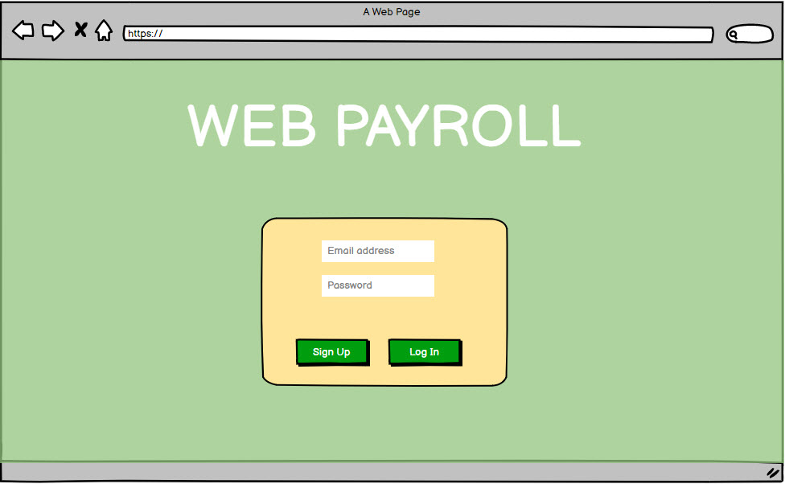
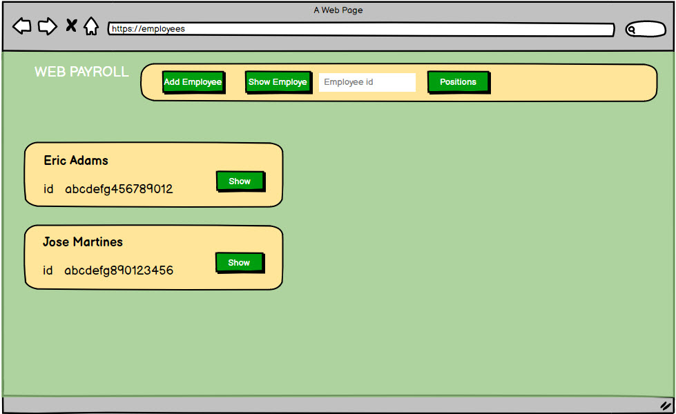
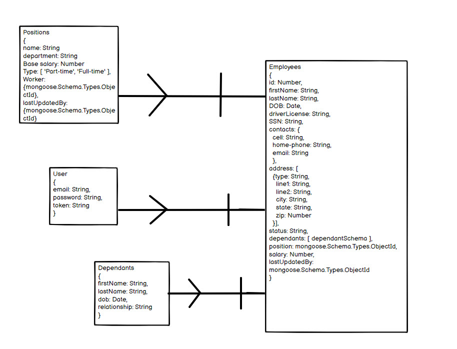

# **Project: Web PAYROLL CRUD application**

## Description: 
Web PAYROLL - application created for keeping track on created positions and companies' employees, calculating salary based on worked hours and salary. Also it allows to keep all information on employees at the app. 

## Versions

## MVP/Version 1

### 1. As an HR, I want to be able to navigate to main page and sign up/log in to the app by inputting email and password.

&nbsp;  
 
### 2. As an HR, I want to be able to navigate to a page with employees and see list of employees on the page.

&nbsp;  
### 3. As an HR, I want to be able to add new employee.

&nbsp;  
### 4. As an HR, I want to be able to update or delete existing employee.

&nbsp;  

## Version 2

### 1. As an HR, I want to be able to navigate to main page where all open position load in. 
### 2. As an HR, I want to be able to Create a new open position.
### 3. As an HR, I want to be able to update any existing position.

&nbsp;

## Version 3

### 1. As an HR, I want to be able to log in employee's worked time.
### 2. As an Accountant, I want to be able to calculate employee's dalary based on worked time.
### 3. As an Accountant, I want to be able to calculate salary taxes and complete paystabs.
### 4. As an Accountant, I want to be able to send out paystabs to employee's emails.

## ERD

### Models' relationship schema

 

